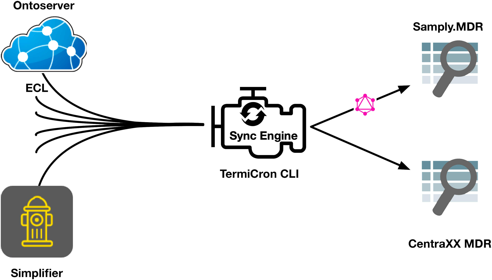

# TermiCron Readme

TermiCron is a system to synchronize terminology with metadata repositories (MDRs).

It takes in HL7 FHIR ValueSets and CodeSystems and is able to convert those to the MDR-specific representations.

This way, the line between MDRs and terminology (servers) becomes clear, and management of terminology in MDRs can be delegated to FHIR terminology tooling.

This work is the subject of a paper submitted to MedInfo 2021:

```
Wiedekopf, J., Ulrich, H., Drenkhahn, C., Kock-Schoppenhauer, A., & Ingenerf, J. (submitted). TermiCron – Bridging the Gap between FHIR Terminology Servers and Metadata Repositories. MedInfo 2021. 
```

## Overview

### Input

Currently, the following input methods are supported:

1. FHIR files in JSON/XML format from disk (CodeSystem/ConceptMap)
2. FHIR resources from a FHIR (Terminology) server, using the bundle profile https://simplifier.net/termicron
3. A package of resources from the Simplifier package registry, using the name and version
4. A SNOMED CT ECL expression that is expanded at run-time.

### Output

Currently, we support the following MDR formats:

1. The open-source [Samply.MDR](https://pubmed.ncbi.nlm.nih.gov/30147039/) ([repo](https://bitbucket.org/medicalinformatics/mig.samply.mdr.gui))
2. The commercial [CentraXX MDR](https://www.kairos.de/en/products/centraxx-mdr/)
3. The federated MDR query language [QL4MDR](https://www.ncbi.nlm.nih.gov/pmc/articles/PMC6421684/) ([repo](https://github.com/itcr-uni-luebeck/QL4MDR))

### Customization & Contributions

Adding support to new input and output formats is easy! We have implemented the system in Kotlin to be as generic as possible. You can add your own input providers, authentication drivers, output serializers and synchronization engines. We welcome feedback and contributions!

The software is licensed under the GNU Affero General Public License (AGPL). We ask that customizations of our software be licensed under the same terms of that license. This means in particular that source code must be made available for forks of the software.

### Concept



## Running

The program is written in Kotlin and uses the Gradle build system.

You can use an IDE like IntelliJ, or the provided Gradle scripts.

To build a JAR using Gradle, execute (on Windows use `gradlew.bat` instead of `./gradlew`):

```bash
./gradlew :bootJar
```

This builds a JAR in the directory `build/libs/TermiCron-1.0.0.jar` that you can start with:

```bash
java -jar build/libs/TermiCron-1.0.0.jar --help
```

and you will get a help screen that looks like this:

```
#<snip>
Usage: termi-cron-console-application [OPTIONS] COMMAND [ARGS]...

Options:
  -h, --help  Show this message and exit

Commands:
  ingest
```

You will need to provide a command line that specifies the ingest and output routes, with associated commands. The parser makes use of subcommands (without leading `--`) and arguments (with `--`):

```
ingest \
simplifier --package-name=de.gecco --package-version=1.0.3 --expansion-endpoint=https://your.terminology.server/fhir \
output \
file --mdr=QL4MDR --output=/tmp/gecco-out-test
```

This uses the specified Simplifier package, expands using the provided Terminology server, and outputs in QL4MDR to `/tmp`.

Every subncommand has a help that explains the available options:

```
ingest --help
```

If you need help running or customizing the application, please get in touch!
